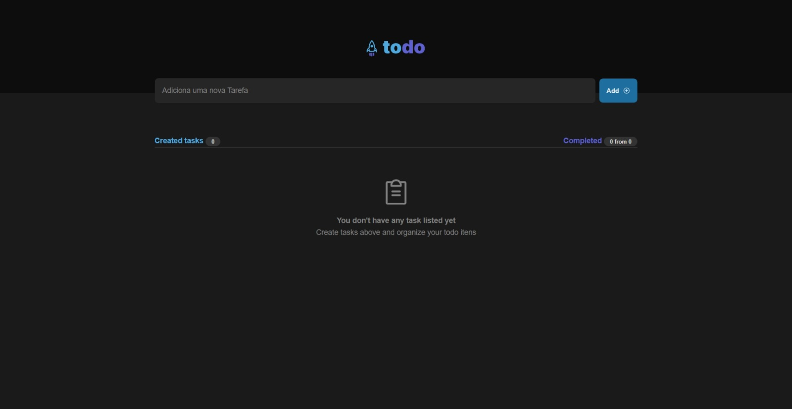
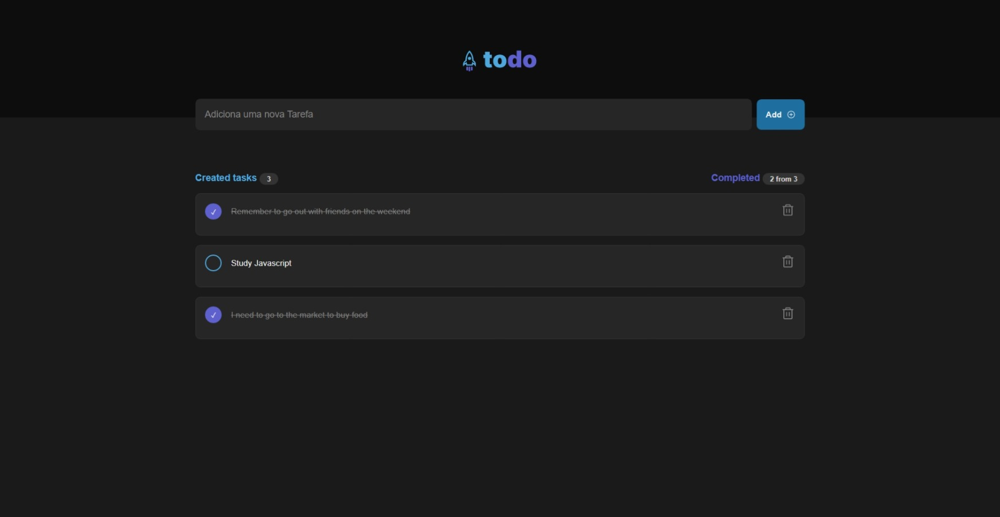
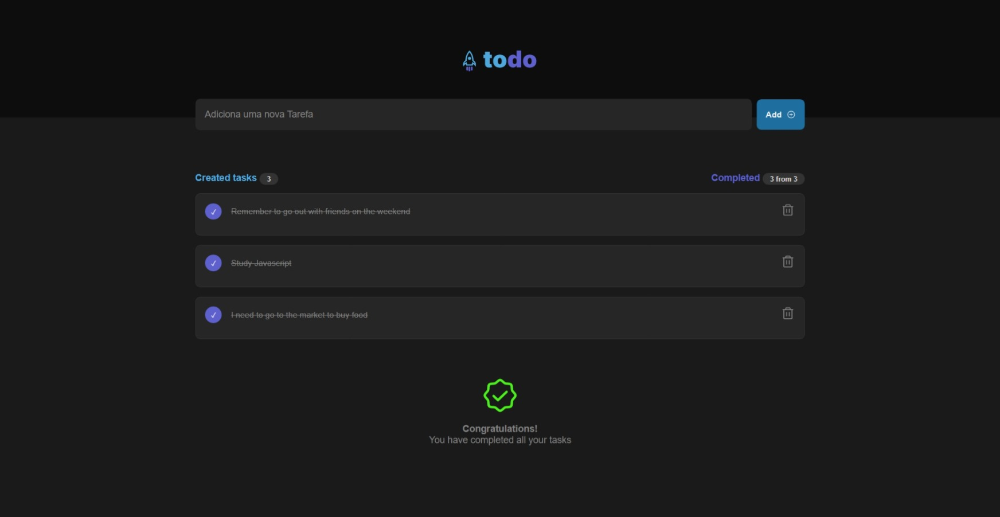

# 📝 Todo App

> A modern task list application built with React and TypeScript

Todo App is an intuitive web application that allows you to efficiently manage your daily tasks. With a clean and modern interface, you can easily add, complete, and remove tasks.

## ✨ Features

- ✅ Add new tasks
- ✅ Mark/unmark tasks as completed
- ✅ Delete unnecessary tasks
- ✅ Counter for created and completed tasks
- ✅ Empty state visualization when there are no tasks
- ✅ Celebration when all tasks are completed
- ✅ Responsive and modern interface

## 🛠️ Technologies

This project was developed using the following technologies:

- **[React](https://reactjs.org)** - JavaScript library for building user interfaces
- **[TypeScript](https://www.typescriptlang.org/)** - Typed superset of JavaScript
- **[Vite](https://vitejs.dev/)** - Ultra-fast build tool and dev server
- **[Phosphor React](https://phosphoricons.com/)** - Icon library
- **[UUID](https://github.com/uuidjs/uuid)** - Unique identifier generation
- **CSS Modules** - Modular and isolated styling

## 📁 Project Structure

```
src/
├── components/          # Reusable components
│   ├── Header/         # Application header
│   ├── Input/          # Input field for new tasks
│   ├── Task/           # Individual task component
│   ├── EmptyTask/      # Empty list state
│   └── Congratulations/ # Celebration message
├── styles/             # Style files
├── App.tsx            # Main component
└── main.tsx           # Application entry point
```

## 🚀 How to Run

### Prerequisites

- Node.js (version 16 or higher)
- pnpm, npm or yarn

### Installation

1. **Clone the repository**
   ```bash
   git clone https://github.com/agleymelo/01-todo-app.git
   cd 01-todo-app
   ```

2. **Install dependencies**
   ```bash
   # With pnpm (recommended)
   pnpm install
   
   # With npm
   npm install
   
   # With yarn
   yarn install
   ```

3. **Run the application**
   ```bash
   # With pnpm
   pnpm dev
   
   # With npm
   npm run dev
   
   # With yarn
   yarn dev
   ```

4. **Access in browser**
   
   Open [http://localhost:5173](http://localhost:5173) in your browser

## 🎨 Design

The application layout was based on the design available on [Figma](<https://www.figma.com/file/i7pC4YRganNhYc3aINMuKO/ToDo-List-(Copy)?node-id=56%3A96>).

## 📚 Concepts Covered

This project demonstrates the application of fundamental React concepts:

- **Functional Components** - Modular interface structuring
- **Props** - Communication between parent and child components
- **State (useState)** - Local state management
- **Events** - Form and click event handling
- **Conditional Rendering** - Dynamic display based on state
- **Lists and Keys** - Efficient list rendering
- **TypeScript** - Static typing for greater robustness

## 🎯 Available Scripts

- `pnpm dev` - Starts the development server
- `pnpm build` - Creates the production build
- `pnpm preview` - Previews the production build locally

## 📷 Screenshots

<p align="center">
  
</p>

<p align="center">
  
</p>

<p align="center">
  
</p>

## 🤝 Contributing

Contributions are always welcome! Feel free to open issues or submit pull requests.

## 📄 License

This project is under the MIT license. See the [LICENSE](LICENSE) file for more details.

---

<p align="center">
  Made with ❤️ by <a href="https://github.com/agleymelo">Agleylson Melo (agleymelo)</a>
</p>
